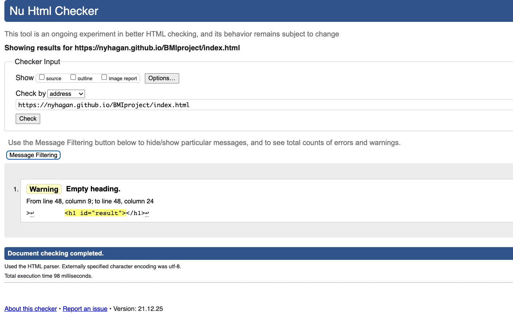
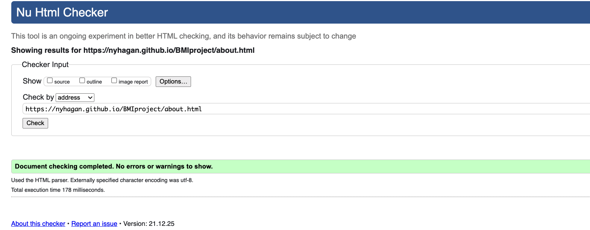
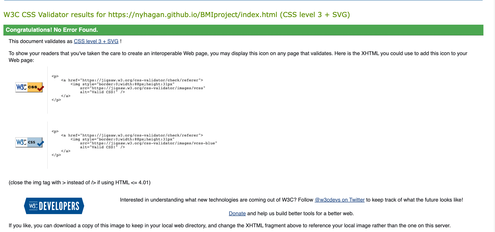
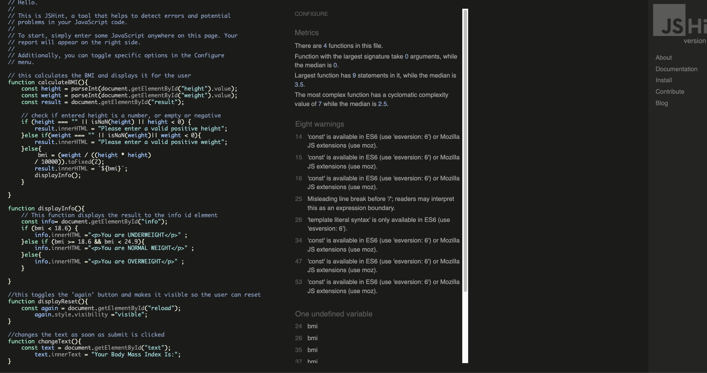
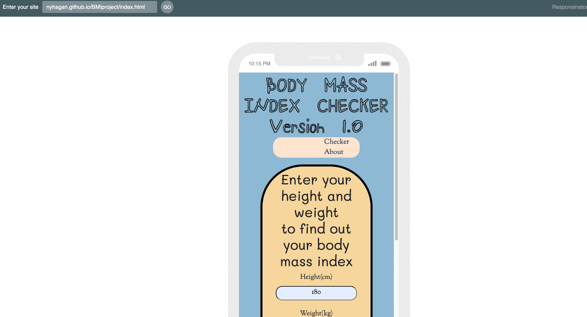
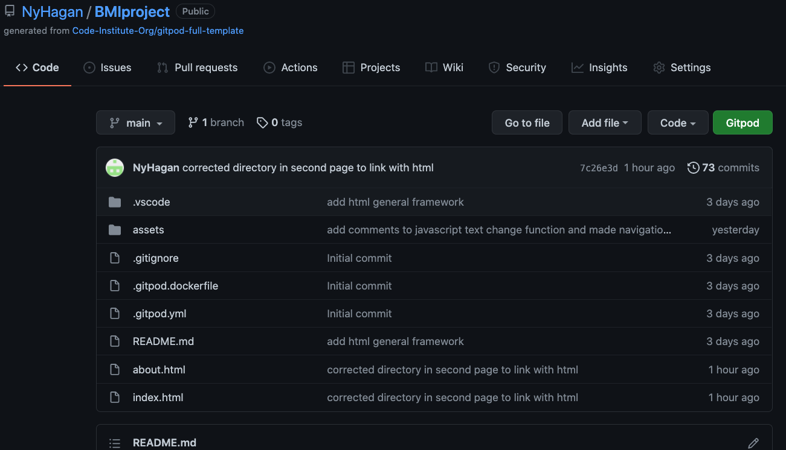

# Check My BMI

Check my BMI is a simple program designed to swiftly and accurately determine the Body Mass index of the user. 

# User Experience

## Project Goals
The goal of this project was to create an application that could provide value in the form of data to the user in a quick and timely manner.

## User Goals
* As a user, I want to be able to make sense of the webpage I am looking at.
* As a user, I want to move about the website as easily as possible.
* As a user, I want to be easily directed to where I need to input data.
* As a user, I want to recieve results as soon asI have entered data.

## Site Admin Goals
* As the site admin, I want the main page of the site to convey as much information as possible about the nature and purpose of the site.
* As the site admin, I want to make sure the user can navigate my pages wihout any hitches.
* As the site admin, I want to include a page where users can learn more about BMI's.
* As the site admin, I want to include ways in which the users can reach and interact with me as the website creator.

## Design Choices
I wanted the site to have a welcoming feel for all ages , and so went with a colour scheme I believe would be best for this. I gave the main area where data would be input a more bright feel, so that it would be the area noticed first upon entering the site.

## Color Reference

| Color             | rgb                                                                |
| ----------------- | ------------------------------------------------------------------ |
| Navy Blue | rgb(152, 193, 217) |
| Black | rgb(10, 10, 15) |
| Aqua | rgb(0, 255, 255)|
| Orange | rgb(250, 121, 33) |
| Cream | rgb(247, 219, 167) |
| Beige | rgb(245, 245, 220) |
| Lime | rgb(218, 230, 225) |
| Aquamarine | rgb(127, 125, 212) |

## FONTS
The main fonts used were Shizuru, Mali, and Sorts Mill Goudy, From Google Fonts.
I felt these three complemented each other, Shizuru gives the title a playful feel while Mali and Sorts Mill Goudy add a more refined look to the page.

## Features

- Fullscreen mode
- Cross platform
- Responsive on all screen sizes
- "About" Page for more infomation
- Eye catching design
- Socials page to get in touch with developer

## TECHNOLOGIES USED

- HTML
- CSS
- JAVASCRIPT

# Libraries/Frameworks used

- Google Fonts : To link the fonts I used to the html 
- Bootstrap : To help create a mobile first approach
- Github : To store my repositories
- Gitpod : All of my coding was done here
- Git : Allowed me to push my work to the repository

# Running Tests

 ## Validators used

The validators below were used to check my cide via URL to endure there were no errors with it.
Javascript however was checked locally.
 -  ## W3C Markup validator
 Index.html : No errors were found 

 

 About.html : No errors were found

 -  ## W3C CSS validator
 Style.css : No errors were found

 -  ## JSHint Javascript code quality checker
 Script.js : No errors were found 

 

## Testing against my User Goals

- ## As a user, I want to be able to make sense of the webpage I am looking at.
I used a simple two page setup with a simplified colour scheme with a brief overview of the purpose of the site, allowing for a page that is very easy to understand.
- ## As a user, I want to move about the website as easily as possible.
All buttons and links are responsive, changing size to reflect where the user is, allowing the user to easily find their bearings around the site.
- ## As a user, I want to be easily directed to where I need to input data.
I Placed Large text showing where the data would need to be input, surrounded by bright colors and is hard to miss.
- ## As a user, I want to recieve results as soon asI have entered data.
Responsiveness is a priority for me, and so the site displays results as soon as the data is entered, swiftly and effectively.

## Testing responsiveness on multiple screen sizes

A program called Responsinator was used  in order to make sure that the site was responsive and worked well accross multiple screen sizes. No major issues were found.

## BUGS

- Bug where the page would constantly reload upon clicking 'check my BMI'. I solved this by adding an onsubmit=return false property to the form this was contained in.

# Deployment

This Project was deployed via Github pages

### Timeline
- Repository was located after logging in : https://github.com/NyHagan/BMIproject
- In the top right corner of where the commits are shown, the settings can be found.
- Clicked on setting and located pages.
- Selected 'main' branch and deisnated the default directory as '/(root)'

### Cloning My Repository
- Locate My Repository via github : https://github.com/NyHagan/BMIproject
- Click on the green 'code' button to create a local clone

## Support

For support, email nanaohagan@gmail.com 

## Optimizations Roadmap

- animations
- more data measurement metrics

## Authors

Nana Hagan
- [@NyHagan](https://github.com/NyHagan)

## Acknowledgements

- My Mentor Spencer Barriball
- Code Institute
- The Learning People
